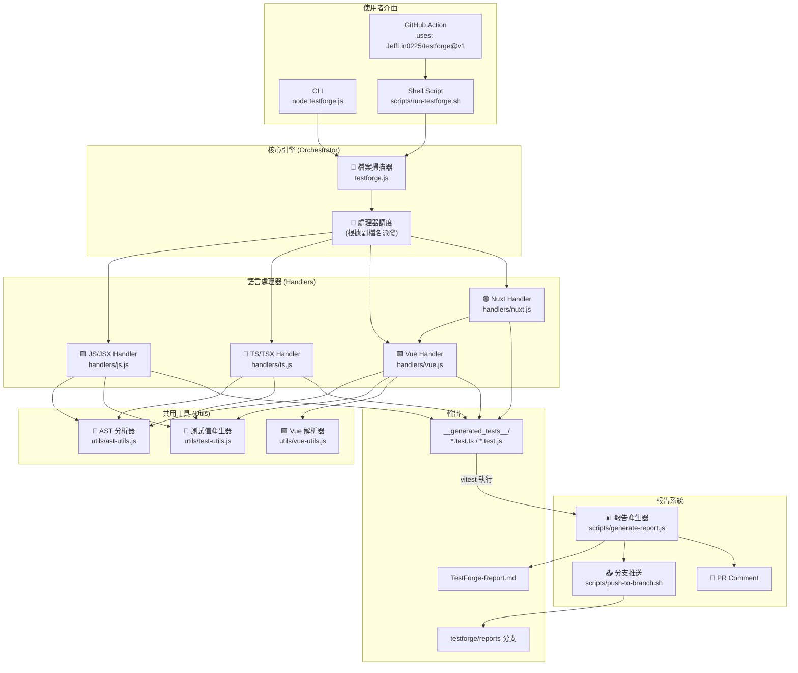
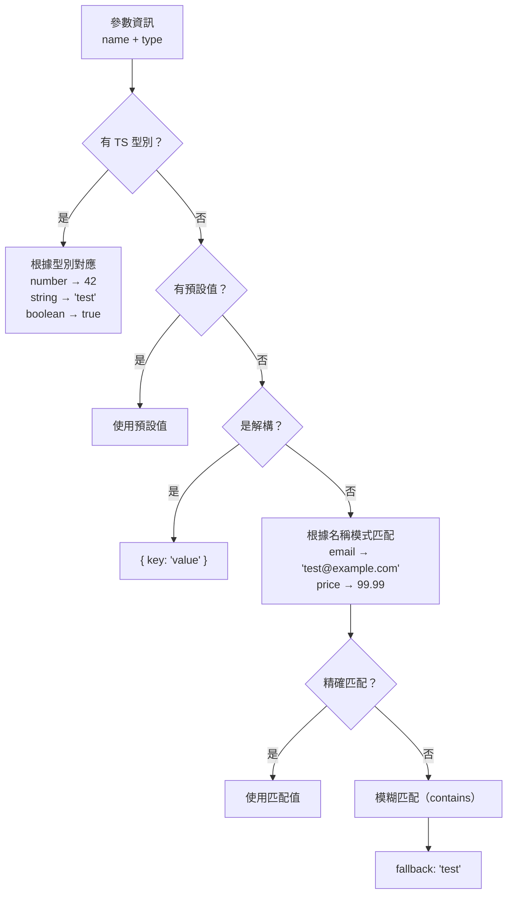

# TestForge 系統架構文件

> 📅 最後更新：2026-07-10

---

## 1. 系統架構總覽



---

## 2. 模組詳細說明

### 2.1 核心調度器 (`testforge.js`)

核心調度器現在非常輕量化，主要負責：
1. **掃描目錄**：遞迴找出目標專案中所有支援的檔案。
2. **派發任務**：根據副檔名載入對應的 Handler（如 `.ts` 載入 `handlers/ts.js`）。
3. **儲存結果**：接收 Handler 回傳的程式碼並寫入檔案系統。

### 2.2 共用工具 (`utils/`)

為了避免程式碼重複 (DRY 原則)，核心邏輯被抽取為共用工具：

- **`utils/ast-utils.js`**：負責讀取原始碼，利用 Babel 解析成 AST (抽象語法樹)，並提供 `extractFunctionInfo` 等方法來擷取函數的名稱、參數、回傳型別與註解。
- **`utils/test-utils.js`**：負責產生測試用的假資料 (Mock Data)、邊界值測試案例 (Edge Cases)，並提供型別檢查的邏輯。
- **`utils/vue-utils.js`**：專門處理 `.vue` 檔案的 `<template>` 與 `<script>` 區塊拆分與分析，擷取 Props、Emits、DOM 元素 (如 Button, Input) 以及資料綁定。

### 2.3 語言處理器 (`handlers/`)

每種檔案類型都有對應的 Handler，介面皆實作 `analyze(filePath)` 與 `generate(result, importPath)`：

- **`handlers/js.js` & `handlers/ts.js`**：
  使用 `utils/ast-utils.js` 分析原始碼，並產生對應的 Vitest 單元測試 (包含同步、非同步測試、快照測試等)。
- **`handlers/vue.js`**：
  整合 `utils/vue-utils.js` 與 AST 分析，一次產生兩份測試（如果適用）：
  1. `<script>` 中導出函數的單元測試。
  2. `<template>` 的 `@vue/test-utils` 元件掛載測試。
- **`handlers/nuxt.js`**：
  為支援 Nuxt 檔案而設計，目前繼承 `handlers/vue.js` 的邏輯，並對輸出的測試加入 Nuxt 專屬標籤，保留未來擴展 Nuxt 特定 API（如 `useAsyncData`）的彈性。

---

## 3. 資料流

### 3.1 CLI 執行流程

```
使用者
  │
  ├── node testforge.js ./project
  │     │
  │     ├── scanDirectory() → 檔案列表
  │     ├── dispatcher (副檔名) → 呼叫 handler.analyze()
  │     ├── handler.analyze() → 擷取函數/元件資訊
  │     ├── handler.generate() → 產生測試程式碼陣列 [{ suffix, code }]
  │     └── testforge.js → 寫入 __generated_tests__/
  │
  ├── npx vitest run → 測試結果 JSON
  │
  └── node scripts/generate-report.js
        │
        └── 寫入報告檔案
```

### 3.2 GitHub Action 執行流程

```
GitHub Event (push / PR)
  │
  ├── Step 1: actions/setup-node → Node.js 環境
  ├── Step 2: npm install → TestForge 依賴
  ├── Step 3: npm install → 目標專案依賴
  ├── Step 4: 偵測框架 → 安裝 vitest 等
  ├── Step 5: testforge.js → 產生測試
  ├── Step 6: 檢查 vitest 設定
  ├── Step 7: vitest run → 測試 & 覆蓋率
  ├── Step 8: generate-report.js → 產生報告
  ├── Step 9: push-to-branch.sh → 推到 testforge/reports
  └── Step 10: github-script → PR Comment
```

---

## 4. 目錄結構

```
testforge/
├── action.yml                      # GitHub Composite Action 定義
├── testforge.js                    # 主入口：檔案掃描與任務調度 (Orchestrator)
├── package.json                    # 專案設定
│
├── handlers/                       # 語言專屬處理器
│   ├── js.js
│   ├── ts.js
│   ├── vue.js
│   └── nuxt.js
│
├── utils/                          # 核心共用邏輯
│   ├── ast-utils.js                # Babel AST 分析
│   ├── test-utils.js               # 測試案例產生邏輯
│   └── vue-utils.js                # Vue template 解析
│
├── scripts/                        # 輔助與 CI 腳本
│   ├── run-testforge.sh            # 主執行腳本
│   ├── generate-report.js          # 統一報告產生器
│   ├── push-to-branch.sh           # 報告分支推送
│   ├── update-readme.js            # 覆蓋率報告更新器
│   └── update-test-report.js       # 單元測試報告更新器
│
├── .github/
│   └── workflows/
│       └── testforge-ci.yml        # 自身 CI workflow
│
├── docs/
│   ├── SPEC.md                     # 技術規格書
│   └── ARCHITECTURE.md             # 架構文件（本檔案）
│
├── sample-vue-project/             # 範例 Vue 專案
│   ├── src/
│   ├── __generated_tests__/        # TestForge 產生的測試
│   ├── package.json
│   └── vite.config.ts
│
├── UnitTest-Report.md              # 單元測試報告
├── Coverage-Report.md              # 覆蓋率報告
└── README.md                       # 專案 README
```

---

## 5. 測試資料推測引擎 (`utils/test-utils.js`)

TestForge 使用多層策略來推測合適的測試資料：



---

## 6. 錯誤處理策略

| 情境 | 處理方式 |
| --- | --- |
| AST 解析失敗 | 跳過該檔案，輸出警告，繼續處理其他檔案 |
| 沒有找到 exported 函數 | 跳過該檔案（可能是設定檔） |
| 缺少 Handler 支援 | 跳過該附檔名的檔案 |
| 部分測試失敗 | 繼續產生報告，在報告中標記失敗的測試 |
| 覆蓋率低於門檻 | 在報告中標記警告，但不阻擋 CI |
| 無法推送到分支 | 輸出警告，不影響測試結果 |
| 目標專案沒有 package.json | 跳過依賴安裝，直接掃描 |
