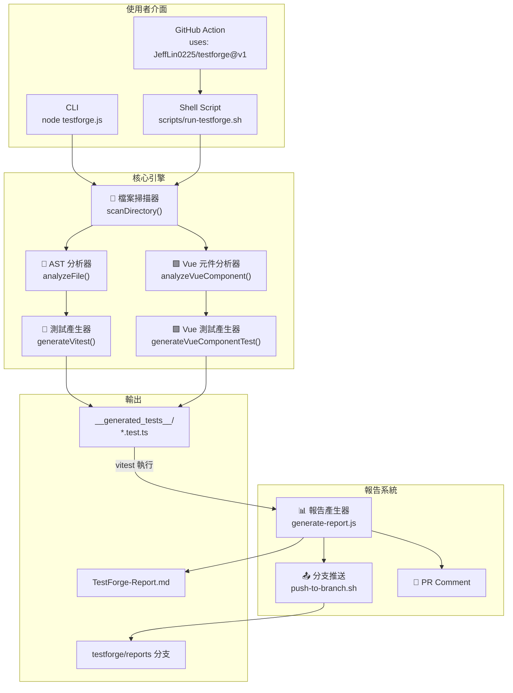
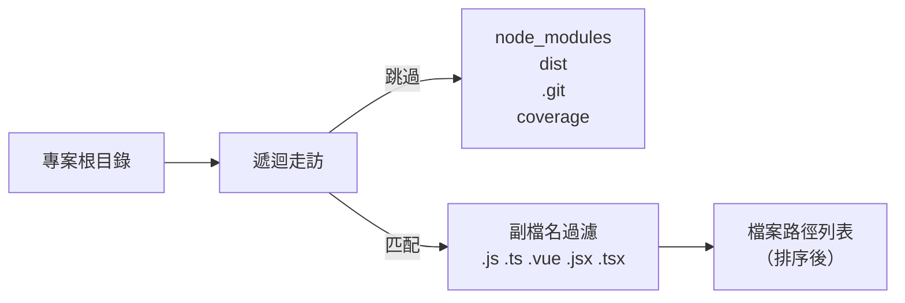
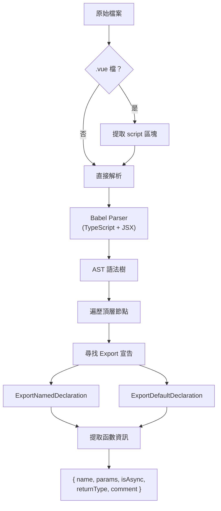
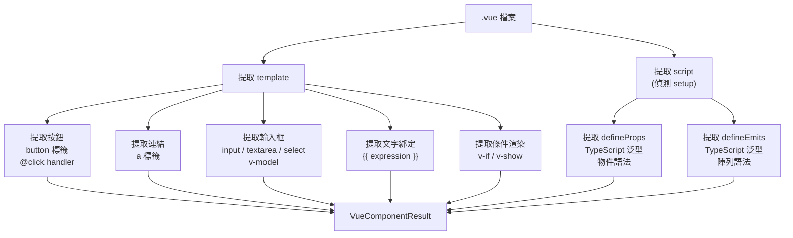
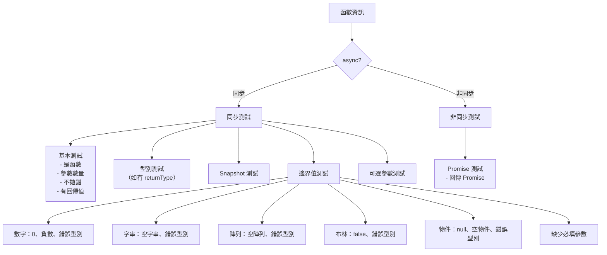
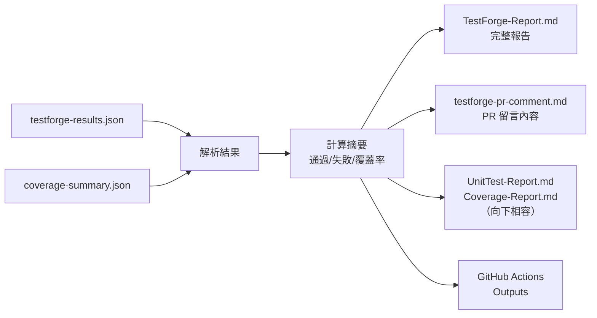
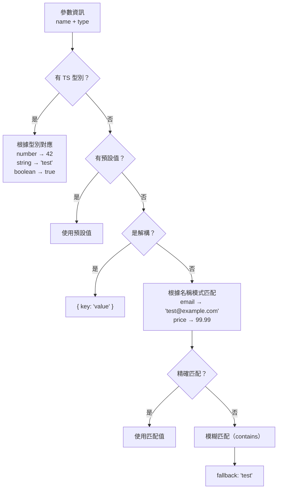

# TestForge 系統架構文件

> 📅 最後更新：2026-07-05

---

## 1. 系統架構總覽



---

## 2. 模組詳細說明

### 2.1 檔案掃描器 (`scanDirectory`)



- **輸入**：專案根目錄路徑
- **輸出**：排序後的檔案路徑陣列
- **忽略清單**：`node_modules`, `dist`, `.git`, `.nuxt`, `.next`, `coverage`, `__tests__`, `__generated_tests__`

### 2.2 AST 分析器 (`analyzeFile`)



**支援的 export 模式**：
```javascript
// 1. 命名匯出函數宣告
export function foo(a: number): string { ... }

// 2. 命名匯出箭頭函數
export const bar = (a, b) => { ... }

// 3. 命名匯出函數表達式
export const baz = function(x) { ... }

// 4. 預設匯出
export default function() { ... }
```

**參數解析支援**：
```javascript
// 一般參數
function(a: number) {}

// 有預設值
function(a = 5) {}

// 解構參數
function({ a, b }: Options) {}

// 陣列解構
function([a, b]) {}

// Rest 參數
function(...args) {}
```

### 2.3 Vue 元件分析器 (`analyzeVueComponent`)



### 2.4 測試產生器 (`generateVitest`)



### 2.5 報告產生器 (`generate-report.js`)



---

## 3. 資料流

### 3.1 CLI 執行流程

```
使用者
  │
  ├── node testforge.js ./project
  │     │
  │     ├── scanDirectory() → 檔案列表
  │     ├── analyzeFile() × N → 函數資訊
  │     ├── analyzeVueComponent() × N → 元件資訊
  │     ├── generateVitest() × N → 測試程式碼
  │     └── generateVueComponentTest() × N → 元件測試程式碼
  │           │
  │           └── 寫入 __generated_tests__/
  │
  ├── npx vitest run → 測試結果 JSON
  │
  └── node scripts/generate-report.js
        │
        └── 寫入報告檔案
```

### 3.2 GitHub Action 執行流程

```
GitHub Event (push / PR)
  │
  ├── Step 1: actions/setup-node → Node.js 環境
  ├── Step 2: npm install → TestForge 依賴
  ├── Step 3: npm install → 目標專案依賴
  ├── Step 4: 偵測框架 → 安裝 vitest 等
  ├── Step 5: testforge.js → 產生測試
  ├── Step 6: 檢查 vitest 設定
  ├── Step 7: vitest run → 測試 & 覆蓋率
  ├── Step 8: generate-report.js → 產生報告
  ├── Step 9: push-to-branch.sh → 推到 testforge/reports
  └── Step 10: github-script → PR Comment
```

---

## 4. 目錄結構

```
testforge/
├── action.yml                      # GitHub Composite Action 定義
├── testforge.js                    # 核心：AST 分析 + 測試產生
├── 1-ast-analyzer.js               # 教學範例：AST 分析器
├── 2-openapi-to-k6.js              # 教學範例：OpenAPI → k6
├── package.json                    # 專案設定
│
├── scripts/
│   ├── run-testforge.sh            # 主執行腳本（跨平台）
│   ├── generate-report.js          # 統一報告產生器
│   └── push-to-branch.sh           # 報告分支推送
│
├── .github/
│   └── workflows/
│       └── testforge-ci.yml        # 自身 CI workflow
│
├── docs/
│   ├── SPEC.md                     # 技術規格書
│   └── ARCHITECTURE.md             # 架構文件（本檔案）
│
├── sample-vue-project/             # 範例 Vue 專案
│   ├── src/
│   │   ├── App.vue
│   │   ├── components/
│   │   ├── composables/
│   │   ├── utils/
│   │   └── api/
│   ├── __generated_tests__/        # TestForge 產生的測試
│   ├── package.json
│   └── vite.config.ts
│
├── update-test-report.js           # (舊) 測試報告更新器
├── update-readme.js                # (舊) 覆蓋率報告更新器
├── UnitTest-Report.md              # 單元測試報告
├── Coverage-Report.md              # 覆蓋率報告
└── README.md                       # 專案 README
```

---

## 5. 測試資料推測引擎

TestForge 使用多層策略來推測合適的測試資料：



---

## 6. 錯誤處理策略

| 情境 | 處理方式 |
| --- | --- |
| AST 解析失敗 | 跳過該檔案，輸出警告，繼續處理其他檔案 |
| 沒有找到 exported 函數 | 跳過該檔案（可能是設定檔） |
| 部分測試失敗 | 繼續產生報告，在報告中標記失敗的測試 |
| 覆蓋率低於門檻 | 在報告中標記警告，但不阻擋 CI |
| 無法推送到分支 | 輸出警告，不影響測試結果 |
| 目標專案沒有 package.json | 跳過依賴安裝，直接掃描 |
